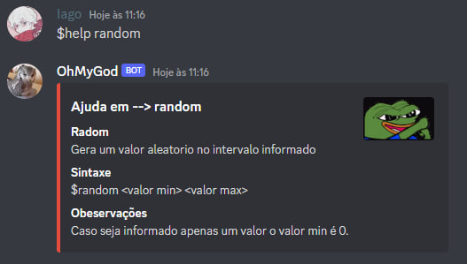
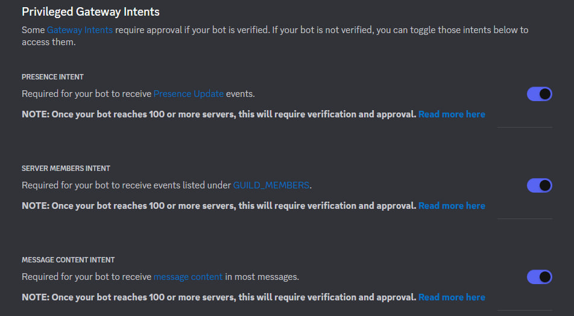
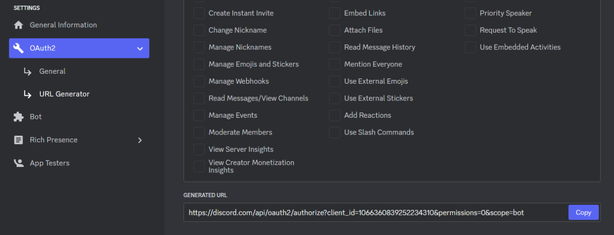

<h1 align="center"> Bot em Python para o Discord 🤖</h1>

## Índices 🗂

* [Sobre](#sobre-o-bot-)
* [Screenshots](#screenshots-)
* [Como utiliza lo](#como-utilizá-lo-)
* [Adicionando novos comandos / Ajustes](#adicionando-novos-comandos--ajustes-)
* [Links](#links-)

## Sobre o Bot ☄
Modelo de bot com algumas funções prontas

## Screenshots 💻
  
* Comando de ajuda

  
  
* Comando de ajuda em um comando especifico

  


## Como utilizá lo 💻

1. Crie o usuário do seu bot no [Potal de desenvolvedor do discord](https://discord.com/developers/applications/) e ative as seguintes opções
  
  
  
2. Na parte de URL Generator crie um link para adcionar o seu bot no servidor desejado
  
  


3. Clone o repositorio
  
```bash
git clone https://github.com/danonep2/discord_bot_python.git
```
  
4. Instalando dependencias do Python

````bash
pip install discord
````

5. No [Potal de desenvolvedor do discord](https://discord.com/developers/applications/) copie o toquem do seu bot e cole no arquivo **index.py**
~~~Python
bot_token = ' YOUR TOKEN '
prefix = '$'
~~~

6. Por fim, execute o **index.py** 🏁

Caso esteja tudo certo o Bot ficara online no servidor que ele foi adicionado e em seu terminal terá algo do tipo:
````bash
2023-02-19 19:41:28 INFO     discord.client logging in using static token
2023-02-19 19:41:29 INFO     discord.gateway Shard ID None has connected to Gateway (Session ID: 39643d03a6042dfd6cc28da14********).
Login in [ nome do seu bot]
````

## Adicionando novos comandos / Ajustes 💻
* Caso deseje mudar as informações no Embed de ajuda vá ate o arquivo **help.py** e adicione suas informações nessa parte do código
~~~Python
    name_author = 'OhMyGod#9543'
    icon_author = 'https://i.pinimg.com/originals/85/be/94/85be94350b6cefd78140c8c8232c75e5.gif'
    img = 'https://media.tenor.com/e73qA4y4pKIAAAAC/pepe-frog.gif'
    thumb_img = 'https://media.tenor.com/AF8QpfRjlJQAAAAC/pepe-bebep.gif'
    footer_text = ' Iago (@danonep2) '
~~~

[exemplo](#screenshots-)

* Para adicionar os comandos basta apenas adicionar ele na lista de comandos no arquivo **help.py**, criar a condição e suas ações dentro da função **__run()__** no arquivo **commands.py**

~~~Python
## help.py
commandsList = [
    'help', 'h',
    'random', 'r',
    'calc',
    'Novo comando'
]
~~~

~~~Python
## commands.py
async def run(message,parametros,command):
    if command == 'novo comando':
        ' Ações do comando '
~~~

## Links 🔗

* Discord API: [documentação](https://discordpy.readthedocs.io/en/stable/intro.html)
* Portal de desenvolvedor Discord: [portal](discord.com/developers/applications)
* Contato: [Telegram](http://t.me/danonep2)

