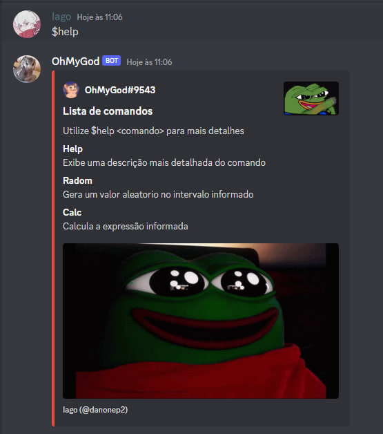

<h1 align="center"> Bot em Python para o Discord</h1>

  <h2> Sobre o Bot</h2>
  
 Modelo de com algumas funções prontas

  <h2>Screenshots</h2>
  
  
- Comando de ajuda

  
  
- Comando de ajuda em um comando especifico

  

<h2>Como utilizá lo:</h2>
  1. Crie o usuário do seu bot no [Potal de desenvolvedor](https://discord.com/developers/applications) (Site do proprio discord) e ative as seguintes opções
  

